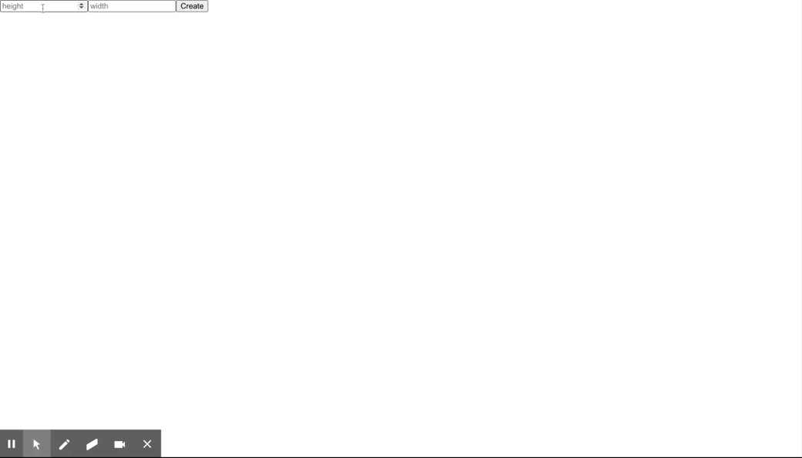

# React Maze Game

A simple game of maze in react. You have to touch all the red sprites, from the green sprite, using keybord up, down, right and left keys to complete the game.

[](https://github.com/anuraghazra/github-readme-stats)

## Live Game

**[Game Live](https://yashpriyam.github.io/react-maze-game/)**

## Game Demo



## Features

- [x] **Key Up:** To move up
- [x] **Key down:** To move down.
- [x] **Key rightk:** To move right.
- [x] **Key left** To move left.


## Liked the game? For getting started with the codebase:

The application uses es6.

```
$ git clone https://github.com/yashpriyam/teachers-authoring-cra.git
$ npm install
$ npm start
```
